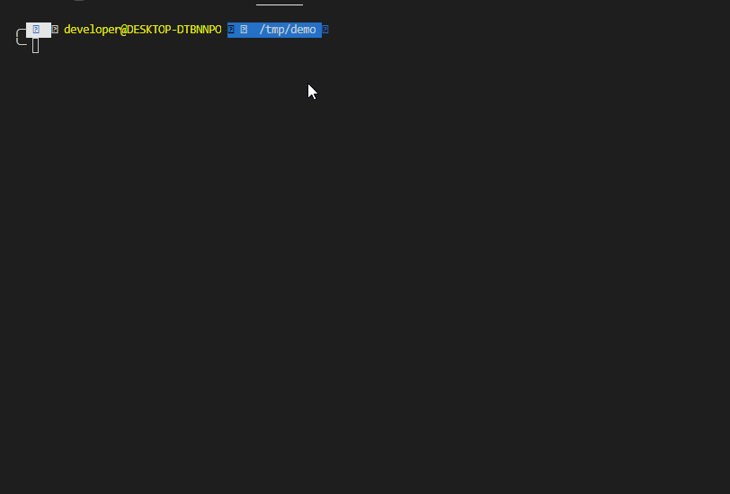

slippi-cli
====
Slippi-cli Description

[](https://oclif.io)
[](https://npmjs.org/package/slippi-cli)
[](https://codecov.io/gh/OGoodness/slippi-cli)
[](https://npmjs.org/package/slippi-cli)
[](https://github.com/OGoodness/slippi-cli/blob/master/package.json)

<!-- toc -->
* [Usage](#usage)
* [Commands](#commands)
<!-- tocstop -->
# Usage
<!-- usage -->
```sh-session
$ npm install -g slippi-cli
$ slp COMMAND
running command...
$ slp (-v|--version|version)
slippi-cli/0.0.5 linux-x64 node-v10.19.0
$ slp --help [COMMAND]
USAGE
  $ slp COMMAND
...
```


<!-- usagestop -->
# Commands
<!-- commands -->
* [`slp help [COMMAND]`](#slp-help-command)
* [`slp stats [FILE]`](#slp-stats-file)

## `slp help [COMMAND]`

display help for slp

```
USAGE
  $ slp help [COMMAND]

ARGUMENTS
  COMMAND  command to show help for

OPTIONS
  --all  see all commands in CLI
```

_See code: [@oclif/plugin-help](https://github.com/oclif/plugin-help/blob/v3.2.2/src/commands/help.ts)_

## `slp stats [FILE]`

describe the command here

```
USAGE
  $ slp stats [FILE]

ARGUMENTS
  FILE  (a|b) [default: world] output file

OPTIONS
  -d, --dir=dir        [default: ] Directory(s) to scan and get stats from
  -f, --file=file      [default: ] File(s) to pull stats from
  -o, --output=output  File to save JSON output
  -p, --path=path      Path to get value in JSON output
  -s, --silent         If you do not want the loading bar to show
  -t, --time           Calculate Total Time from File(s)

EXAMPLE

       $ slp stats -d slippi-dir -o output.json
         .... (saves the output to output.json)
       $ slp stats -d slippi-dir -f game.slp -t
       {
         "frames": 17838451,
         "seconds": 297307.51666666666,
         "minutes": 4955.125277777778,
         "hours": 82.5854212962963,
         "days": 3.4410592206790125,
         "averageGame": "1.9868184754521965 Minutes Per Game",
         "fileCount": 2494
       }

       $ slp stats -f game.slp -p 'overall[0].inputCounts'
       {
         "inputCounts": {
           "buttons": 16,
           "triggers": 5,
           "cstick": 0,
           "joystick": 15,
           "total": 36
         }
       }
```

_See code: [src/commands/stats.ts](https://github.com/OGoodness/slippi-cli/blob/v0.0.5/src/commands/stats.ts)_
<!-- commandsstop -->
